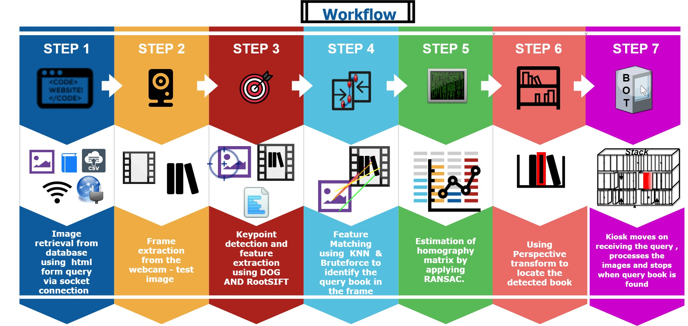
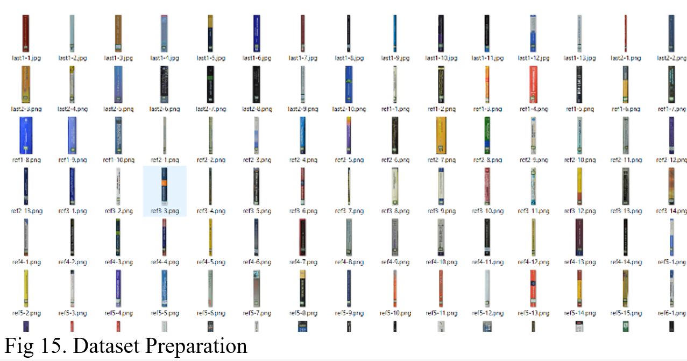
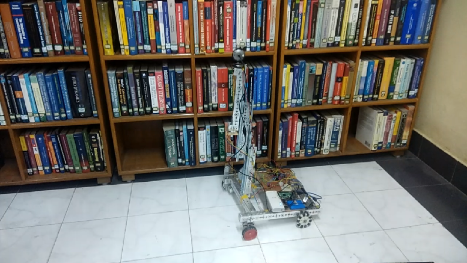
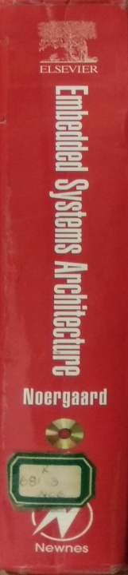
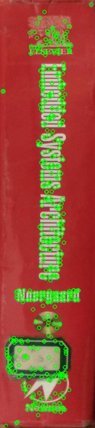
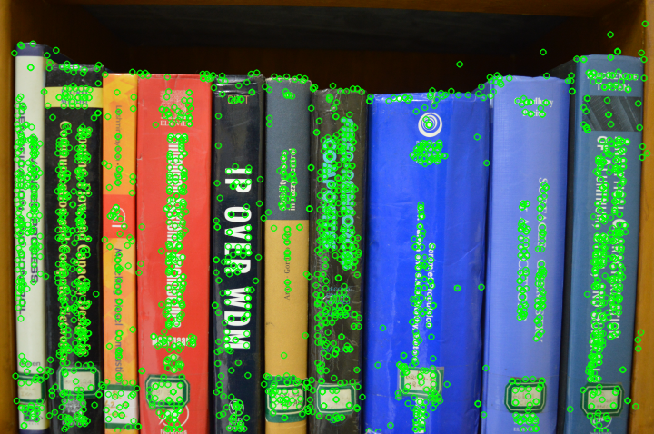
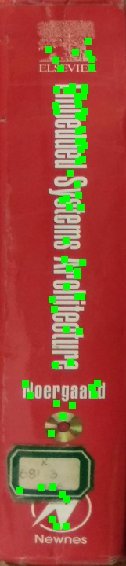
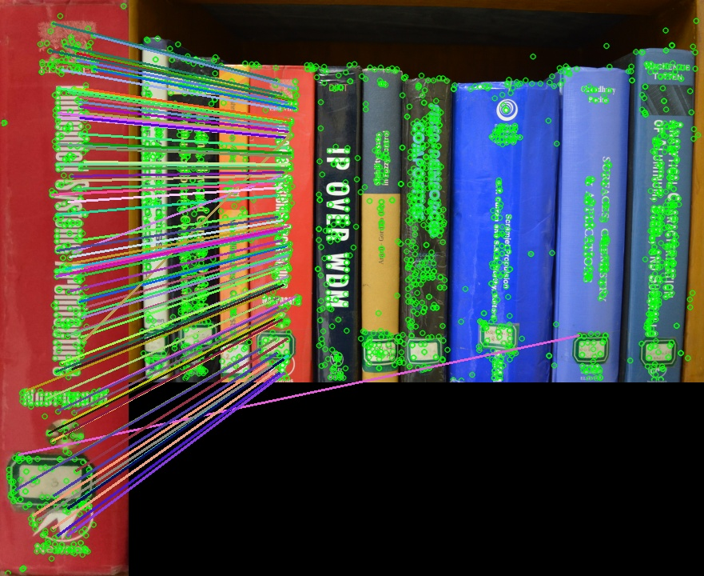
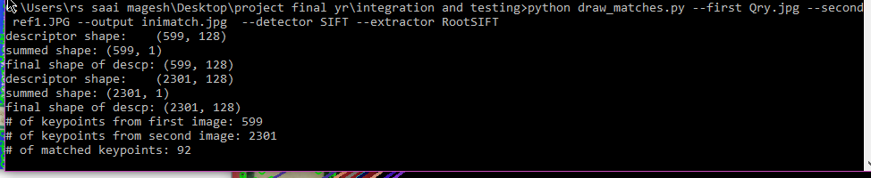
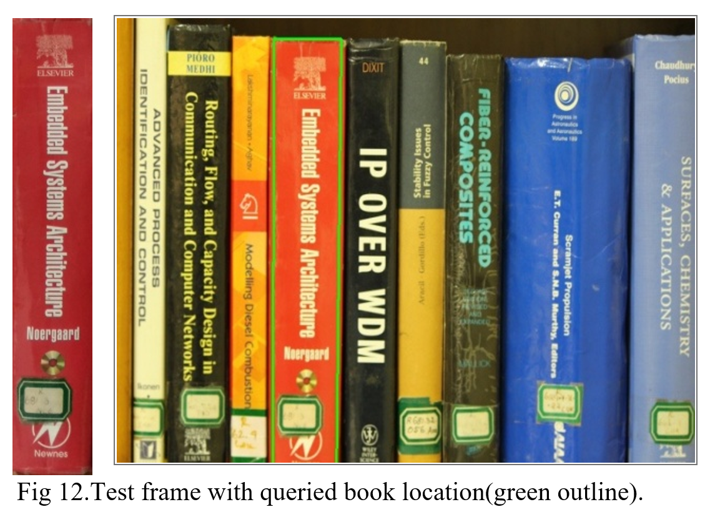

# Feature Matching Based Library Book Detection
This repository contains relevant code, research paper and the dataset for my bachelor thesis project (2018) on feature matching based library book detection system

## Project Workflow


# Paper Title:Feature Matching Based Book Detection System
-[Refer the paper here](research_paper/Feature_Matching_Based_Book_Detection_System_Research_Paper-Sai_Mukkundan.pdf)

## Abstract
> Finding a particular book from a large stack in a 
library is a difficult and time consuming task. Library users need 
to search the entire stack all by themselves and this is not a simple 
job. To reduce their strain and guide them in accessing the book 
they want, an autonomous system for book detection is proposed. 
This paper is all about the identification of user queried book from 
a huge collection of books in the library stack in an efficient way. 
The book to be detected is found by using image processing 
techniques like feature extraction and feature matching methods. 
It involves maintaining a separate database of book spine images 
locally and comparing the existing features of the queried book 
with the features present in the test image. DoG key point detector 
and RootSIFT feature descriptor are used to find the maximum 
likeliness between the queried and test image. The algorithm 
applied is an accurate method as it proves to be scale, affine and 
illumination invariant and can also be deployed easily in real-time 
at minimal cost.

## Evaluation Results

**Datasets:**  
- 150 high-resolution images of different book spines were captured, cropped to book boundaries, and resized to a height of 720 pixels.  
- A separate database was created for these 150 images, including book name, author, edition, and image path.  
- A test dataset of 50 images featuring various stacks of books was used for evaluation (see Fig. 15 in the paper) 

**Accuracy:**  
- The Difference of Gaussian (DoG) with RootSIFT descriptor produced the highest number of accurate matches (69 out of 82 keypoints, score: 84), though it also yielded some false positives (13).
- STAR and MSER detectors achieved perfect accuracy (100%) on the few matches they produced (4 accurate matches out of 4 keypoints), but their low number of matches makes homography computation difficult.
- DoG with color descriptor reduced false positives and produced sharper matches (32 accurate matches out of 82 keypoints, score: 80).
- SURF and HARRIS produced very few or no accurate matches in this setup.

**Speed:**  
-  Algorithms with fewer matched keypoints (e.g., STAR, MSER, HARRIS) are typically faster, while DoG and DoG with color descriptor process more keypoints and may require more computation in compute constrained devices.

**Comparison:**  
- DoG with RootSIFT outperforms other detectors in terms of the number of accurate matches, making it more robust for book detection in varied conditions (occlusions, tilt, rotation, non-uniform illumination).
- STAR and MSER are highly accurate but limited by the low number of matches, impacting their practical usability for homography and book localization.
- Combining DoG with a color descriptor helps eliminate false positives caused by similar publisher logos, resulting in more reliable matches after RANSAC filtering.

**Table 1. Keypoint algorithm accuracy :**

| Key-point Detection Algorithm | Matched keypoints | False Positives | Accurate Matches | Score | True Negatives |
|------------------------------|-------------------|-----------------|------------------|-------|---------------|
| DoG with SIFT                | 82                | 13              | 69               | 84    | No            |
| DoG with RootSIFT            | 22                | 10              | 12               | 54    | Yes           |
| SURF                         | 8                 | 8               | 0                | 0     | No            |
| MSER                         | 4                 | 0               | 4                | 100   | No            |
| STAR                         | 4                 | 0               | 4                | 100   | No            |
| HARRIS with SIFT             | 4                 | 0               | 4                | 100   | Yes           |
| HARRIS with RootSIFT         | 4                 | 4               | 0                | 0     | No            |
| DoG with Color Descriptor    | 82                | 9               | 32               | 80    | No            |

**Additional Notes:**  
- The algorithm successfully detects books even when they are partially occluded, tilted, rotated, or under uneven lighting.
- False positives from DoG for books with similar publisher logos can be mitigated by integrating color descriptors before homography computation.

## Demo Video & Results

### Real time implementation
- [Watch the demonstration video of real time implementation ](https://youtu.be/aeV9uAz13hs)



### Results
#### Query Image

#### Test Image

#### Keypoint Detections using color descriptor - Query image

#### Keypoint Detections using color descriptor - Test image

#### Feature Matches using color descriptor - Query image

#### Feature Matches using color descriptor - Test image

#### Feature Mapping results using color descriptor - Query & Test image


#### Feature Mapping result with bounding box on the result book spine - Query & Test image


## Repository Contents

### Key Directories and Files

- **README.md**  
  Provides an overview of the project, organisation repo and citation information.

- **.gitattributes & .gitignore**  
  Configuration files for Git and Git LFS, specifying which files to track and ignore.

- **paper/**  
  Contains the main research paper describing the methodology, experiments, and results.

- **output/**  
  Has the output of the project:
  - **demo_video/**: Contains demonstration videos (e.g., `bookdetectiondemo.mp4`).
  - **results/**: Holds evaluation result images

- **code/**  
  The main source code for the project, typically including scripts for feature extraction, matching, and evaluation.

- **dataset/**  
  Contains unprocessed and processed image of library books and the csv file used for testing and demonstration.

- **presentation/**  
  Contains more details on the real time implementation, literature survey, possible methods tried to identify the book title before the finalised approach.

## Citation

If you use this work, please cite:
```bibtex
@inproceedings{FeatureMatchingBookDetection,
title={Feature Matching Based Book Detection System},
authors={Sai Mukkundan R, Melvin A, Shoban Chander E and Dr.V.Sathiesh Kumar },
booktitle={3rd International Conference on Recent Trends in Engineering and Technology(ICRTET-18)},
year={2018}
}
```
## References

- [Implementing RootSIFT in Python and OpenCV – PyImageSearch][1]  
  A practical guide to implementing the RootSIFT descriptor, which improves upon the original SIFT for object recognition and retrieval tasks.[1]

- [OpenCV Documentation: Feature Matching + Homography][2]  
  Official OpenCV tutorial explaining how to perform feature matching and compute homography for object detection and localization.[2]

[1]: https://pyimagesearch.com/2015/04/13/implementing-rootsift-in-python-and-opencv/
[2]: https://docs.opencv.org/4.x/d7/dff/tutorial_feature_homography.html
